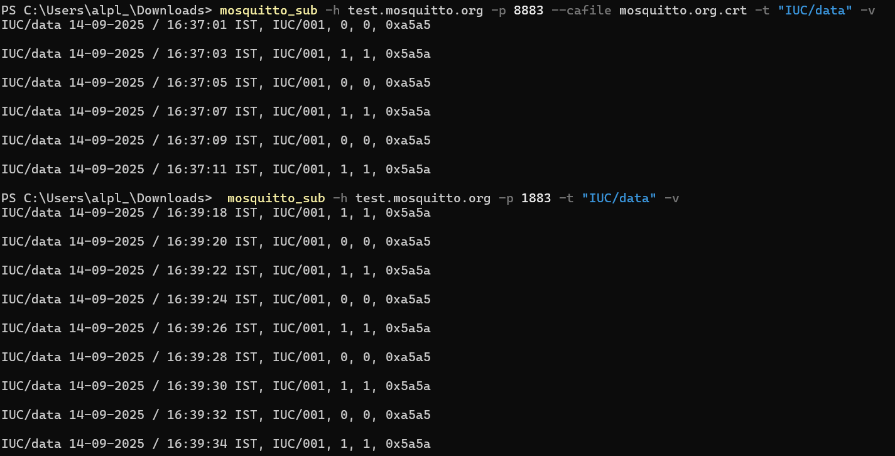

# UniCon Application

## Description
 Unicon appli is a Universal controller built on STM32H7RS MCU on Threadx platform. 
 This project is designed to [state the purpose or functionality of the project].

## Features
- threadx
- netx
- mqtt

## Testing
- Use the below command to get data from the topic "IUC/data" on test.mosquitto.org broker using TLSv1.2
  > **Note:** Run this in the UniCon_Appli project folder
  ```
  mosquitto_sub -h test.mosquitto.org -p 8883 --cafile cert/mosquitto.org.crt -t "IUC/data" -v
  ```
- Use the below command to get data from the topic "IUC/data" on port 1883
  ```
  mosquitto_sub -h test.mosquitto.org -p 1883 -t "IUC/data" -v
  ```
  > **Note:** the broker somehow bridges the data between port 8883 and 1883. I can receive data on both ports.

  


## Changelog
All notable changes to this project will be documented in this section.

The format is based on [Semantic Versioning](https://semver.org/).

### [Unreleased]
- [Add new features, fixes, or changes planned for the next release]

### [0.3.0] - 03-09-2025
- Added Netx with ethernet driver for Nucleo H7RS board
- Added TCP server at port 6000
- Added DHCP client to get dynamic IP address from DHCP server

### [0.1.0] - 03-09-2025
- Clock changed to External 24MHz crystal oscillator

### [0.0.0] - 03-09-2025
- Initial release.

## License
[Specify the license under which the project is distributed.]

## Contact
For any questions or feedback, please contact [your email or GitHub profile link].

## Installation
1. Clone the repository:
2. Open the project in Eclipse.
3. Build the project to resolve dependencies.

## Usage
1. Run the application:
   - Open the main class in Eclipse.
   - Click `Run` to start the application.
2. [Provide instructions on how to use the application].

## Testing
- To execute tests, [provide instructions for running tests].

## License
[Specify the license under which the project is distributed.]

## Contact
For any questions or feedback, please contact [your email or GitHub profile link].

## Accessing the GitHub Repo from Multiple Laptops

To use the same GitHub account and access this repository from multiple laptops, follow these steps:

1. **Generate SSH Keys on Each Laptop**
   - Open a terminal (Git Bash or WSL on Windows).
   - Run:  
     `ssh-keygen -t ed25519 -C "anupthackar@gmail.com" -f ~/.ssh/anup-sourcerrer`
   - Press Enter to accept the default file location and set a passphrase if desired.

3. **Configure SSH on Each Laptop**
   - Create or edit the SSH config file:  
     `nano ~/.ssh/config`
   - Add the following (replace with your GitHub username):
     ```
     Host anup-sourcerrer
      HostName github.com
      User git
      IdentityFile ~/.ssh/anup-sourcerrer
      IdentitiesOnly yes
     ```

4. **Test SSH Connection**
   - Run:  
     `ssh -T git@anup-sourcerrer`
   - You should see a welcome message.

5. **Clone or Use the Repo**
   - Use SSH URLs to clone:  
     `git clone git@anup-sourcerrer:Sourcerrer/UniCon.git`
   - You can now push/pull from both laptops.

> Repeat these steps on each laptop you want to use.
