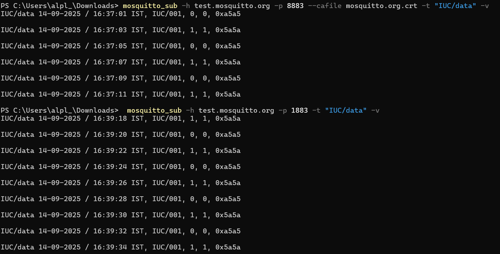

# UniCon Application

## Description
 Unicon appli is a Universal controller built on STM32H7RS MCU on Threadx platform. 
 This project is designed to [state the purpose or functionality of the project].

## Features
- threadx
- netx
- mqtt

## Testing
- For mosquitto broker on local server 
    - ```Get-Service mosquitto``` to be run in powershell to check if the mosquitto broker is running
    - ```Start-Service mosquitto``` to start the mosquitto broker service
    - ```mosquitto_pub -h localhost -t "IUC/data" -m "Hello from local broker"``` to publish data to the topic "IUC/data" on local mosquitto broker
- Use the below command to get data from the topic "IUC/data" on test.mosquitto.org broker using TLSv1.2
  > **Note:** Run this in the UniCon_Appli project folder
  ```
  mosquitto_sub -h test.mosquitto.org -p 8883 --cafile cert/mosquitto.org.crt -t "IUC/data" -v
  ```
- Use the below command to get data from the topic "IUC/data" on port 1883
  ```
  mosquitto_sub -h test.mosquitto.org -p 1883 -t "IUC/data" -v
  ```
  > **Note:** the broker somehow bridges the data between port 8883 and 1883. I can receive data on both ports.

  

- Use ```Resolve-DnsName unicon.local``` to check if the mDNS is working fine.

## Project Creation and Flashing
- Check if the external_loader.stldr is present in the ""UniCon_ExtMemLoader/debug"
  folder. If not copy the .elf file and reaname as .stldr. Add it to the debug configuration of the application project. 


## Changelog
All notable changes to this project are documented below. This changelog was generated from the repository commit messages — for full details see the project's git history (for example: `git log --pretty=format:"%h %ad %an %s" --date=short`).

The format shows short commit hash, date, author, and commit subject as recorded in the repo.

### [Unreleased]
- Work in progress for the next release (current branch: `wip`).

### [v0.10.0] - 2026-01-12
Commits:
- 08fef7f — 2026-01-12 — sourcerrer — V0.10.0-dirty1
- 33985d4 — 2026-01-11 — sourcerrer — V0.10.0-dirty0

Notes: Incremental updates leading to v0.10.0.

### [v0.9.0] - 2026-01-09
Commits:
- efd7191 — 2026-01-09 — sourcerrer — V0.9.0-dirty0

Notes: v0.9.0 marker in commit history.

### [v0.8.1] - 2026-01-05
Commits:
- 3370883 — 2026-01-05 — sourcerrer — V0.8.1-dirty1
- 793fe50 — 2026-01-05 — sourcerrer — V0.8.1-dirty0

Notes: Patch release (small fixes and stability improvements).

### [v0.8.0] - 2025-12-22..2025-12-28
Commits:
- 607cfc8 — 2025-12-28 — sourcerrer — V0.8.0-dirty1
- 8391920 — 2025-12-24 — sourcerrer — V0.8.0-dirty1
- 55347ba — 2025-12-23 — sourcerrer — V0.8.0-dirty0
- 8155ae4 — 2025-12-22 — sourcerrer — V0.8.0-dirty0

Notes: Feature and bug fix collection forming v0.8.0.

### [v0.7.0] - 2025-12-19
Commits:
- 8e697dc — 2025-12-19 — sourcerrer — V0.7.0-dirty0
- cf81550 — 2025-12-19 — Sourcerrer — V0.7.0-dirty0

Notes: v0.7.0 marker; see commits for details.

### [v0.6.1] - 2025-10-07
Commits:
- 2fe6027 — 2025-10-07 — Sourcerrer — V0.6.1-dirty0

Notes: Patch release; moved TCP server code and C++ migration details are in surrounding commits.

### [v0.6.0] - 2025-09-30 .. 2025-12-13
Commits:
- 6c4c9e8 — 2025-09-30 — Sourcerrer — V0.6.0-dirty13
- 79c5670 — 2025-12-13 — sourcerrer — V0.6.0-dirty14

Notes: RTC resync and input toggling behaviour added across these commits.

### [v0.4.0] - 2025-09-08 .. 2025-09-19
Commits (chronological):
- 9dba21b — 2025-09-19 — sourcerrer — V0.4.0-dirty13
- ec28ac3 — 2025-09-15 — sourcerrer — V0.4.0-dirty10
- 1b98147 — 2025-09-14 — sourcerrer — V0.4.0-dirty9
- f85223c — 2025-09-10 — sourcerrer — V0.4.0-dirty8
- 740372c — 2025-09-10 — sourcerrer — V0.4.0-dirty7
- c096db6 — 2025-09-09 — sourcerrer — V0.4.0-dirty6
- b5e1fdd — 2025-09-09 — sourcerrer — V0.4.0-dirty5
- 516b8ff — 2025-09-09 — sourcerrer — V0.4.0-dirty4
- b7c236c — 2025-09-09 — sourcerrer — V0.4.0-dirty3
- e22a704 — 2025-09-08 — sourcerrer — V0.4.0-dirty2
- b15bd44 — 2025-09-08 — sourcerrer — V0.4.0-dirty2
- d531eeb — 2025-09-08 — sourcerrer — V0.4.0-dirty1
- 6aa2944 — 2025-09-08 — sourcerrer — V0.4.0-dirty0

Notes: NetX ethernet driver, DHCP client improvements, and the TCP server (port 6000) introduced during this period.

### [v0.3.0] - 2025-09-07
Commits:
- a83ef32 — 2025-09-07 — sourcerrer — V0.3.0-dirty2
- 98f31de — 2025-09-07 — sourcerrer — V0.3.0-dirty1
- cc2b538 — 2025-09-07 — sourcerrer — V0.3.0-dirty0

Notes: Alpha and pre-release iterations present for v0.3.0.

### [v0.2.x and earlier]
Commits:
- 717e347 — 2025-09-19 — sourcerrer — V0.2.0-dirty1
- ab07ba2 — 2025-09-06 — sourcerrer — Merge branch 'dev/threadx' into main
- 23bbeff — 2025-09-06 — sourcerrer — V0.1.0-dirty1
- 39cc676 — 2025-09-06 — sourcerrer — V0.2.0-dirty2
- 221deee — 2025-09-06 — sourcerrer — V0.2.0-dirty1
- db4da30 — 2025-09-06 — Sourcerrer — V0.2.0-dirty1
- 831b87d — 2025-09-06 — Sourcerrer — V0.2.1
- efc7872 — 2025-09-04 — sourcerrer — V0.2
- 4930d44 — 2025-09-06 — sourcerrer — V0.1.0-dirty1
- 870c63a — 2025-09-03 — anup-peppermint — V0.1.0
- 2663be1 — 2025-09-03 — anup-peppermint — V0.0

Notes: Early development history and initial releases.

> This changelog includes raw commit subjects that contain version markers (e.g. `V0.8.0-dirty0`). If you'd like these turned into human-friendly release notes (summaries of the actual code changes), I can expand each commit into a short natural-language description by scanning the diffs for those commits.

## License
[Specify the license under which the project is distributed.]

## Contact
For any questions or feedback, please contact [your email or GitHub profile link].

## Installation
1. Clone the repository:
2. Open the project in Eclipse.
3. Build the project to resolve dependencies.

## Usage
1. Run the application:
   - Open the main class in Eclipse.
   - Click `Run` to start the application.
2. [Provide instructions on how to use the application].

## Testing
- To execute tests, [provide instructions for running tests].


## Accessing the GitHub Repo from Multiple Laptops

To use the same GitHub account and access this repository from multiple laptops, follow these steps:

1. **Generate SSH Keys on Each Laptop**
   - Open a terminal (Git Bash or WSL on Windows).
   - Run:  
     `ssh-keygen -t ed25519 -C "anupthackar@gmail.com" -f ~/.ssh/anup-sourcerrer`
   - Press Enter to accept the default file location and set a passphrase if desired.

3. **Configure SSH on Each Laptop**
   - Create or edit the SSH config file:  
     `nano ~/.ssh/config`
   - Add the following (replace with your GitHub username):
     ```
     Host anup-sourcerrer
      HostName github.com
      User git
      IdentityFile ~/.ssh/anup-sourcerrer
      IdentitiesOnly yes
     ```

4. **Test SSH Connection**
   - Run:  
     `ssh -T git@anup-sourcerrer`
   - You should see a welcome message.

5. **Clone or Use the Repo**
   - Use SSH URLs to clone:  
     `git clone git@anup-sourcerrer:Sourcerrer/UniCon.git`
   - You can now push/pull from both laptops.

> Repeat these steps on each laptop you want to use.